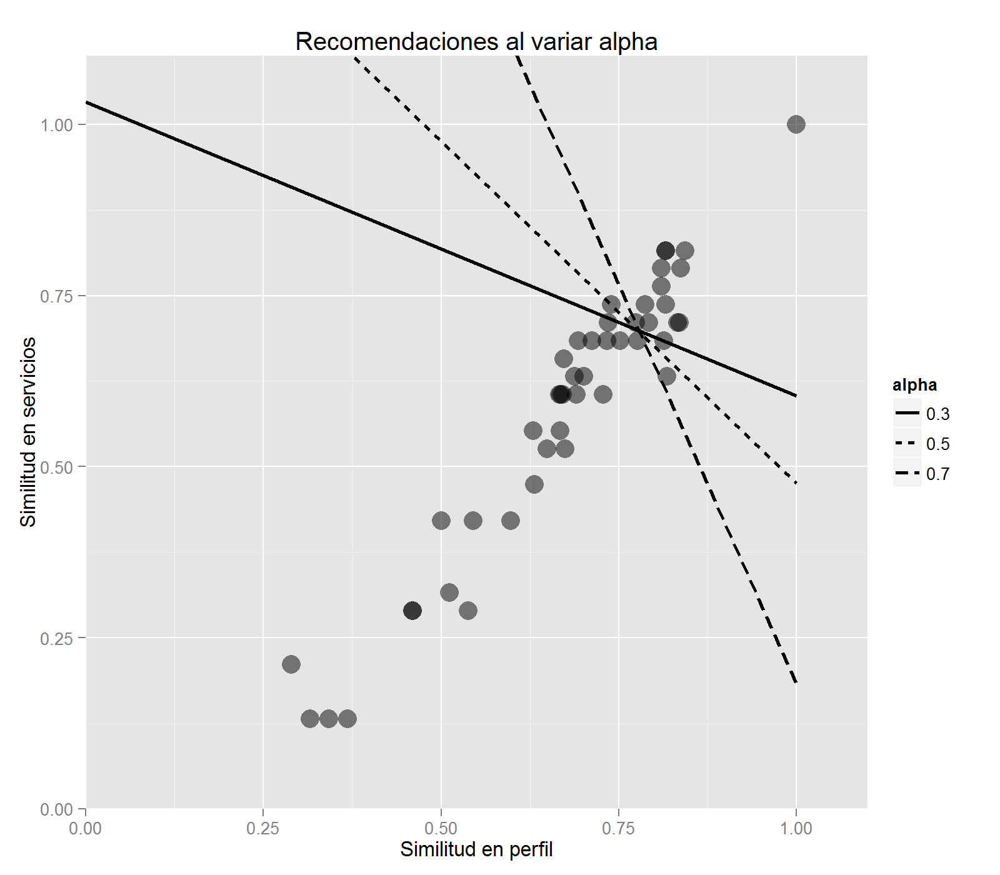

```{r, echo=FALSE, message=FALSE, warning=FALSE}
library(Matrix)
library(dplyr)
library(tidyr)
library(ggplot2)
library(knitr)
#setwd("C:/Users/bmxddt005062/Documents/recomendacion_de_hoteles")

# Datos
load('../datos/datos_completos.Rdata')
```


Primer enfoque: Servicios
------------------------------------

### Caracterización de hoteles

Se caracterizó cada hotel principalmente con los servicios que ofrece. Inicialmente se transformó la tabla con tuplas (hotel, servicio) en una matriz binaria $H$ con un renglón por cada servicio y una columna por cada hotel. Es decir, para cada tupla $(h_j, s_i)$ en la tabla original, se puso $H_{ij} = 1$. Todas las demás entradas de $H$ son 0. De este modo, si se denotan las columnas de $H$ por $H_j, j = 1, \dots, N_h$, entonces se puede comparar los hoteles mediante sus vectores caracteristicos $H_j$.

### Métricas

Se probaron diversas métricas para comparar los hoteles, que están enlistados a continuación junto con sus ventajas y desventajas:

* **Jaccard:** La similitud de Jaccard entre dos conjuntos $A,B$ está definida por $sim_J(A,B) = \frac{A \cap B}{A \cup B} \in [0,1]$ y equivale a la probabilidad de que al tomar un elemento $x$ al azar de la colección de los objetos contenidos en A ó en B, $x$ esté tanto en $A$ como en $B$. Es fácil ver que $dist_J(A,B) = 1 - sim_J(A,B)$ tiene las propiedades de una distancia. En el contexto de la recomendación de hoteles, se puede pensar en que cada hotel es un conjunto con los servicios que tiene.
    + Fórmula: $sim_J(h_i, h_j) = \frac{H_i^TH_j}{|\{k | H_{ki} = H_{kj} = 0\}|}$.
    + Pros: La distancia de Jaccard tiene varias ventajas. Por ejemplo, es muy fácil de interpretar y de calcular.
    + Contras: Una caracteristica que tiene es que penaliza bastante fuertemente los conjuntos con muchos elementos no en común. Esto es, incluso si $A \subset B$ ó si casi todo $A$ está contenido en $B$, si $B$ es mucho mayor que $A$, entonces la similitud será baja. El problema de esto en el contexto de hoteles es que a un cliente no le importará mucho que un hotel tenga más de lo que había pedido, siempre y cuando el perfil, el precio y el lugar sean apropiados.
* **Coseno:** La distancia coseno normalizada entre dos vectores $x,y$ está definida por el mínimo ángulo entre ellos, dividido entre $180^o$, es decir $d_{cos}(x,y) = \frac{1}{180^o} arccos\left(\frac{x^Ty}{\|x\|\|y\|}\right)$. En este caso se puede tomar los vectores binarios $H_j$ y compararlos con esta métrica.
    + Fórmula: $d_{cos}(h_i, h_j) = \frac{1}{180^o} arccos\left(\frac{H_i^TH_j}{\sqrt{(\sum_k H_{k,i}^2) (\sum_k H_{k,i}^2)}}\right)$.
    + Pros: En el contexto de los hoteles, es más laxa y permite que se incluya una cantidad de servicios (por ejemplo 3 restaurantes) de manera natural.
    + Contras: Es complicada de interpretar, puesto que representa un ángulo de vectores de dimensión alta. El resultado es que sea algo impredecible y difícil de corroborar su efectividad a la hora de capturar similitudes.
* **Absoluta:** La distancia absoluta consiste en la cantidad de servicios que sólo tiene uno de los hoteles, pero no ambos. Se puede normalizar con $|A \cap B|$ para tener una medida comparable entre hoteles.
    + Fórmula: $d_{abs}(h_i, h_j) = \frac{|\{k | H_{ki} \neq H_{kj}\}|}{|A \cap B|}$
    + Pros: Es interpretable igual que la similitud de Jaccard.
    + Contras: Tampoco captura la asimetría de que no importa tanto que haya servicios de más.
* **Hinge:** Es asimétrica, por lo cuál es una pseudodistancia. Es similar a la pérdida _hinge_ que se utiliza en las máquinas de soporte vectorial. Esencialmente es la distancia absoluta, pero sólo toma las diferencias de un lado. Es decir si $A$ tiene algo pero $B$ no lo tiene, entonces aumenta la distancia, pero no al revés. En este caso optamos por no normalizarla porque se pierde la interpretabilidad de cuántos servicios tiene $A$ que no tiene $B$.
    + Fórmula: $d_{h}(h_i, h_j) = |\{k | H_{ki} = 1 \text{ y } H_{kj} = 0\}|$
    + Pros: Es interpretable y captura la asimetría que se busca.
    + Contras: Tiende a proponer hoteles mejores (pues tienen más servicios), por lo que no es muy acertada con el precio de las recomendaciones. Además, dado que no es simétrica, hay que tener cuidado al momento de utilizarla, puesto que no necesariamente $d_h(x, y) = d_h(y, x)$.


Categorías de servicios
------------------------------------

Después de diversas pruebas se llegó a la conclusión de que utilizar los servicios crudos no era la mejor estrategia. El problema es que independientemente de la métrica que se elja, únicamente se busca coincidencias exactas de los servicios. En la vida real esto rara vez es así. Si por ejemplo un hotel tiene futbol y otro tiene basquetbol, o si uno tiene masajes y otro spa, hay un cierto grado de coincidencia entre ellos. La idea entonces es permitir que los servicios similares sean intercambiables. A _grosso modo_ lo que eso permite es que se pueda comparar los hoteles mediante sus perfiles, en lugar de directamente por sus servicios.

### Definición de las categorías

Para definir la categoría a la que debería pertenecer cada servicio se utilizó criterio humano asistido con un aglomerado jerárquico. Esta elección se debe a que por un lado, aglomerar completamente a mano no tiene ningún sustento más allá de la experiencia del analista, y por otro, si se hace automáticamente, las categorías podrian no estar bien definidas o ser incoherentes.

Para caracterizar cada servicio $s_i$ se utilizó el vector binario de longitud $N_h$ correspondiente al i-ésimo renglón de la matriz $H$. Sobre esos vectores se aplicó un aglomerado jerárquico utilizando distancia coseno junto con el criterio de Ward, descrito [aquí](https://es.wikipedia.org/wiki/M%C3%A9todo_de_Ward). Posteriormente, a mano se corrigió las inconsistencias para generar categorías razonables. El análisis produjo el siguiente dendrograma:

```{r, echo=FALSE, fig.width=12}

x <- servicios_hoteles_sparse %>% as.matrix
x <- x[apply(x, 1, sum) != 0, ] # Omitimos los servicios que no tiene ningún hotel.

# Jerárquico Ward con distancia coseno (ángulo)
d <- matrix(0, nrow(x), nrow(x), dimnames = list(rownames(x), rownames(x)))
for(i in 1:nrow(x)){
  for(j in 1:nrow(x)){
    d[i,j] <- acos(cor(x[i,], x[j,]))/pi
  }
}
d <- as.dist(d)
cl <- hclust(d, method = 'ward.D')

# Dendrograma
plot(cl)
```

El dendrograma anterior sirvió de apoyo para generar las categorías de servicios. En primera instancia se generaron `r nrow(claves_categorias)` categorías; los servicios están agrupados dentro de ellas como sigue:

```{r, echo=FALSE, message=FALSE}
claves_servicios %>%
  group_by(Categoria) %>%
  summarise(Servicios = paste(Clav_Servicio, collapse=', ')) %>%
  kable
```

### Caracterización de hoteles

Dado que ya se conoce la categoría a la que pertenece cada servicio, se puede proceder a formar la nueva matriz $C$, que tiene un renglón por cada categoría y una columna por cada hotel. Las entradas de $C$ están dadas por $C_{ij} = \sum_{k \in Cat_i} H_{kj}$. A diferencia de la matriz $H$, que es rala y binaria, $C$ es una matriz densa y con entradas enteras.

### Métricas

Para este caso se introdujo la _divergencia_, otra distancia que proporciona información distinta a las demás. Los candidatos en este modelo fueron las distancias anteriores, más la divergencia. A continuación se describe las diferencias entre las versiones para servicios y las de categorías:

* La similitud de Jaccard ya no tiene sentido.
* La distancia coseno se aplica sobre $C_j$ en lugar de $H_j$, pero es la misma fórmula.
* La distancia absoluta se debe calcular con la fórmula general (que es equivalente a la anterior cuando los vectores son binarios, siempre y cuando no se normalice). La normalización ya no tiene sentido. La fórmula queda como sigue:

$$
d_{abs}(h_i, h_j) = \|C_{ki} - C_{kj}\|_1 = \sum_k |C_{ki} - C_{kj}|
$$

* De forma similar a la distancia absoluta, la pseudodistancia _hinge_ tiene un cambio en la fórmula que es equivalente cuando los vectores son binarios:

$$
d_h(h_i, h_j) = \sum_k max\{C_{ki} - C_{kj}, 0\},
$$

es decir penaliza únicamente los casos en los que $h_i$ tiene más servicios en una categoría que $h_j$.

* **Divergencia:** Se descubrió que si se normaliza los vectores $H_i$ dividiéndolos entre la suma de sus elementos, entonces se tiene una especie de perfil del hotel, que va más allá del número de servicios que tiene. La distancia absoluta sobre los vectores normalizados se denota _divergencia_ y está dada por

$$
d_{div}(h_i, h_j) = \frac{1}{2} \sum_k |\frac{C_{ki}}{\sum_m C_{mi}} - \frac{C_{kj}}{\sum_n C_{nj}}|
$$

Más adelante se explican sus ventajas y las razones detrás de la elección particular de sus partes.

A excepción del caso de Jaccard, todas las métricas se adaptan a las categorías y ahora sí dan una noción de similitud que toma en cuenta lo servicios que son sustitutos entre sí. La divergencia introduce el concepto de perfiles de hotel ignorando la cantidad de servicios disponibles.


Modelo
------------------------------------

El objetivo del modelo es que dado un hotel, el sistema recomiende alternativas similares. En esta sección se definirá el concepto de similaridad que se utilizó. Para ello, hay que entender que el concepto de similitud entre dos hoteles es complejo y varía entre individuos. Lo que se quiere lograr es que dentro de las 5 ó 10 primeras recomendaciones se pueda ofrecer algo atractivo para la mayoría de los clientes. Para ello se dividió el concepto de similaridad en diversos elementos:

* __Precio:__ No es coherente ofrecer un hotel similar o con muchas ventajas si es demasiado caro.
* __Distancia:__ Se quiere ofrecer hoteles cercanos al que se buscó originalmente, pero el concepto de cercanía debe variar según la zona.
* __Perfil:__ Se quiere que los hoteles recomendados tengan una filosofía similar al original.
* __Servicios:__ Se busca que los hoteles recomendados tengan la mayor cantidad de caracteristicas del hotel original que se pueda.

Ahora continuación se describe cómo se incorporó cada uno de estos elementos en el modelo.

### Precio

Es razonable pensar que dados dos hoteles idénticos, un cliente siempre elegirá el más barato. Es por esto que no se impuso ninguna cota inferior al precio de los hoteles recomendados, _siempre y cuando cumplieran los demás criterios_. Sin embargo, puede ser desalentador que las sugerencias contengan hoteles demasiado caros. Por ello, el primer parámetro del modelo que hay que ajustar es el porcentaje por encima del precio del hotel en cuestión que se permitirá. Es decir, si se define un parámetro $\gamma > 0$ y si $p(h_i)$ es el precio por noche promedio en, digamos, el último año o en los últimos dos años del hotel en cuestión, entonces filtramos de entrada a todos los hoteles cuyo precio por noche en dicho periodo sea mayor a $(1 + \gamma)*p(h_i)$. Los demás hoteles continúan a las siguientes etapas del filtro. La razón para usar un precio promedio en un periodo amplio es reflejar el nivel "real" de precio de los hoteles en el largo plazo. Más adelante se tratará con el efecto que pueden tener los descuentos de corto plazo.

### Distancia: filtro estático

Usualmente, cuando se quiere conocer las distancias entre cualesquiera dos individuos de una población, basta almacenar la mitad de la matriz de distancias entre ellos. Es decir, para $n$ individuos, basta guardar $(n^2 - n)/2$ números. Sin embargo, en este caso las pseudo distancias que se utilizaron no son simétricas, por lo que es necesario almacenar toda la matriz (excepto la diagonal), que resulta en $n^2 - n$ elementos. Cuando $n$ es grande, es infactible generar todos ellos, pues se vuelve muy grande la matriz de distancias y además el cálculo tomaría demasiado tiempo. Incluso para $n$ moderada ($n = 100,000$, digamos), el proceso podría tomar muchas horas o hasta días.

El problema con calcular todas las distancias y luego aplicar los filtros es que la gran mayoría de los cálculos se desperdiciarían. Para evitar eso, además del filtro de precio descrito anteriormente se implementó un filtro simple y estático de distancia. La idea es tomar un valor fijo, digamos $r_{outer} \overset{def}{=} 30 km$, y únicamente comparar los hoteles dentro de dicho radio. Al círculo definido por este valor lo denominamos la __cerca exterior__. Los hoteles que cumplen tanto el criterio de precio de largo plazo como el estático de distancia se denominan __candidatos iniciales__.

### Perfil y servicios

A lo largo de las pruebas se optó por utilizar la pérdida _hinge_ por su interpretabilidad directa y por su caracteristica asimétrica. Sin embargo, como está explicado arriba, esto resulta en hoteles más caros, pues tienden a tener más servicios en general. El problema de esto radica en que no es suficiente filtrar con el precio. Para ilustrarlo, supongamos que un hotel $h_i$ está en la ciudad y tiene instalaciones para negocios. Por otro lado supongamos que hay un hotel $h_j$ en la playa que también tiene instalaciones para negocios. La distancia _hinge_ de $h_i$ a $h_j$ será más bien chica (aunque probablemente al revés no lo sea), pues no hay prácticamente nada que tenga $h_i$ que no tenga $h_j$. Si $h_j$ pasa el filtro de precio, entonces podria acabar en las recomendaciones, incluso a pesar de haber mejores opciones. La siguiente gráfica ilustra cuándo la pérdida _hinge_ es alta y cuándo es baja:

```{r, echo=FALSE, fig.width=12}

x <- data.frame(x = c('BEACH','BUSINESS','ENTERTAINMENT','CONVENIENCE'),
                y = c(0.1,6,10,8),
                Hotel = rep('Original', 4))
y <- data.frame(x = c('BEACH','BUSINESS','ENTERTAINMENT','CONVENIENCE'),
                y = c(8,4,8,10),
                Hotel = rep('Alternativa 1', 4))
z <- data.frame(x = c('BEACH','BUSINESS','ENTERTAINMENT','CONVENIENCE'),
                y = c(0.1,8,2,4),
                Hotel = rep('Alternativa 2', 4))
aux <- rbind(
#   cbind(x,panel='Original'),
  cbind(x,panel='Baja'),
  cbind(y,panel='Baja'),
  cbind(x,panel='Alta'),
  cbind(z,panel='Alta'))

ggplot(aux) +
  geom_bar(aes(x,y,fill=Hotel), stat='identity', position='dodge', width=0.5) +
  scale_fill_manual(values = c('black', rgb(0.1,0.8,0.3), rgb(1,0.2,0.1))) +
  facet_wrap(~ panel) +
  labs(title='Características del la pérdida hinge', x='', y='Número de servicios')
```

Por otra parte, se descubrió que se puede utilizar la divergencia para comparar los perfiles de los hoteles. Por ejemplo, utilizando la divergencia como criterio, un hotel que tiene categorías (BEACH, BUSINESS, CONVENIENCE) = (6,2,4) es indistinguible de uno con (3,1,2), incluso a pesar de que este segundo tiene muchos menos servicios disponibles. Lo que se compara en este caso son las proporciones de cada categoría sobre el total de servicios que tiene cada hotel. Como en este caso cualquier diferencia es significativa, se optó por utilizar la distancia absoluta en la fórmula de la divergencia, pero dividida entre 2 para que la distancia resultante estuviera entre 0 y 1.

```{r, echo=FALSE, fig.width=12}

x <- data.frame(x = c('BEACH','BUSINESS','ENTERTAINMENT','CONVENIENCE'),
                y = c(0.1,6,10,8),
                Hotel = rep('Original', 4))
y <- data.frame(x = c('BEACH','BUSINESS','ENTERTAINMENT','CONVENIENCE'),
                y = c(0.1,3,4,4),
                Hotel = rep('Alternativa 1', 4))
z <- data.frame(x = c('BEACH','BUSINESS','ENTERTAINMENT','CONVENIENCE'),
                y = c(10,9,2,4),
                Hotel = rep('Alternativa 2', 4))
aux <- rbind(
#   cbind(x,panel='Original'),
  cbind(x,panel='Baja'),
  cbind(y,panel='Baja'),
  cbind(x,panel='Alta'),
  cbind(z,panel='Alta'))

ggplot(aux) +
  geom_bar(aes(x,y,fill=Hotel), stat='identity', position='dodge', width=0.5) +
  scale_fill_manual(values = c('black', rgb(0.1,0.8,0.3), rgb(1,0.2,0.1))) +
  facet_wrap(~ panel) +
  labs(title='Características del la divergencia', x='', y='Número de servicios')
```

En los ejemplos anteriores se ha visto algunos ejemplos del comportamiento del _hinge_ y de la divergencia. En la siguiente gráfica hay un ejemplo que combina ambos criterios:

```{r, echo=FALSE, fig.width=12, fig.height=8}

x <- data.frame(x = c('BEACH','BUSINESS','ENTERTAINMENT','CONVENIENCE'),
                y = c(0.1,6,10,8),
                Hotel = rep('Original', 4))
y <- data.frame(x = c('BEACH','BUSINESS','ENTERTAINMENT','CONVENIENCE'),
                y = c(1,5,9,9),
                Hotel = rep('Buena recomendación', 4))
z <- data.frame(x = c('BEACH','BUSINESS','ENTERTAINMENT','CONVENIENCE'),
                y = c(0.1,3,4,4),
                Hotel = rep('Similar pero más austero', 4))
v <- data.frame(x = c('BEACH','BUSINESS','ENTERTAINMENT','CONVENIENCE'),
                y = c(10,10,10,10),
                Hotel = rep('Tiene servicios pero otro perfil', 4))
w <- data.frame(x = c('BEACH','BUSINESS','ENTERTAINMENT','CONVENIENCE'),
                y = c(10,9,2,4),
                Hotel = rep('Mala recomendación', 4))

aux <- rbind(
  cbind(x,div='div = Baja', hinge='hinge = Baja'),
  cbind(y,div='div = Baja', hinge='hinge = Baja'),
  cbind(x,div='div = Baja', hinge='hinge = Alta'),
  cbind(z,div='div = Baja', hinge='hinge = Alta'),
  cbind(x,div='div = Alta', hinge='hinge = Baja'),
  cbind(v,div='div = Alta', hinge='hinge = Baja'),
  cbind(x,div='div = Alta', hinge='hinge = Alta'),
  cbind(w,div='div = Alta', hinge='hinge = Alta'))

ggplot(aux) +
  geom_bar(aes(x,y,fill=Hotel), stat='identity', position='dodge', width=0.5) +
  scale_fill_manual(values = c('black', rgb(0.1,0.8,0.3),
                               rgb(0.9,0.1,0.5), rgb(0.1,0.3,0.8), rgb(1,0.2,0.1))) +
  facet_grid(div ~ hinge) +
  labs(title='Características combinadas: divergencia y hinge', x='', y='Número de servicios')

```

Es indudable que tanto la divergencia como la distancia _hinge_ proporcionan información. El problema es que la divergencia ignora la calidad del hotel, mientras que la distancia _hinge_ no captura muy bien la filosofía de los hoteles. La solución es combinarlas para tomar todo en cuenta. Para poder hacerlo primero se tuvo que reducir ambas a la misma escala, dividiendo _hinge_ entre el número total de servicios del hotel original para que estuviera entre 0 y 1 igual que la divergencia. Dado que lo que se busca son hoteles similares, es más fácil pensar en similaridades que en distancia, por lo que se usaron las similitudes correspondientes al hinge y a la divergencia:

$$
sim_{h}(x,y) = 1 - \frac{d_h(x,y)}{N_{serv,x}} \\
sim_{div}(x,y) = 1 - d_{div}(x,y)
$$

Estas dos medidas de similitud se combinaron en un _score_ mediante un parámetro $\alpha \in (0, 1)$, que por ahora supondremos dado. De este modo, dado que se buscó el hotel $h_i$, se puede calcular el _score_ de cualquier hotel $h_j$ con la siguiente fórmula:

$$
score(h_i, h_j) = \alpha sim_{div}(h_i, h_j) + (1- \alpha) sim_{h}(h_i, h_j))
$$

La gráfica siguiente ilustra el efecto de $\alpha$ sobre las recomendaciones en el espacio de las similitudes asociadas a la divergencia (perfil) y a la pseudo distancia _hinge_ (servicios):



**Elección de $\alpha$**

El objetivo del _score_ es que los hoteles sean una mejor recomendación conforme mayor sea su _score_. Para reflejar eso hay que elegir $\alpha$ de manera adecuada. Originalmente se había elegido tentativamente $\alpha = 0.5$ con la idea de que no hay razón a priori de favorecer una de las medidas. Sin embargo, un factor que afecta su importancia es la escala. Aunque ambos van de 0 a 1, en general la similitud de perfil tiende a variar menos que la de servicios. Para tomar eso en cuenta se incorporó un Análisis de Componentes Principales para decidir qué tanto convenía mover $\alpha$. Lo que se busca es encontrar la dirección $(\alpha, 1 - \alpha)$ que maximice la discriminación de hoteles. Aplicando ACP a los candidatos iniciales, sobre las variables similitud de perfil (1 - divergencia) y de servicios (1 - _hinge_ normalizada) se obtiene las ponderaciones $a_p$ y $a_s$, las entradas del eigenvector correspondiente a la primera componente principal. Normalizando para que sumen 1, se tiene que

$$
  \alpha = \frac{a_p}{a_p + a_s} \\
  1 - \alpha = \frac{a_s}{a_p + a_s}
$$

La idea de utilizar este criterio es que se quiere una dirección que maximice la discriminación del _score_, y precisamente eso es lo que logra usar ACP. El cálculo de $\alpha$ es bastante estable, por lo que basta hacerlo una vez. Después de los análisis, resultó que la $\alpha$ óptima en este sentido es aproximadamente $1/3$, lo que indica que se le da un peso mayor a los servicios que al perfil.

### Distancia: criterio dinámico

La mayoría de los clientes tienen en mente un destino antes de comprar, no un hotel. Encontrar esos hoteles es precisamente el objetivo del sistema que se está proponiendo. Por ello no se quiere que las recomendaciones estén demasiado lejos del hotel. La dificultad radica en que se quiere los mejores hoteles cercanos al hotel original, pero no hay una noción clara de cercanía, ni de cuánto debe pesar la distancia y cuánto una buena coincidencia. Originalmente se había pensado en tomar los primeros $n$ hoteles más cercanos al original, filtrar por precio y luego tomar los de mejor _score_. Eso funciona bien en la mayoría de los casos. Sin embargo, si un hotel es único en su clase en la zona, se debe dar mayor libertad de búsqueda. Considérese el siguiente gráfico:

```{r, echo=FALSE}
library(ggthemes)
set.seed(1234)
x2 <- data.frame(x=c(0,rnorm(29),1.5,-1), y=c(0,rnorm(29),1.2,-1.3), s=c(5,2*runif(29),5,6), col=c('original',rep('opciones malas',29), 'opciones buenas', 'opciones buenas'))
qplot(x,y,data=x2,size=s,color=col) +
  scale_color_manual(name='',values = c('opciones malas'=rgb(0.9,0.5,0.5),
                                'opciones buenas'=rgb(0.1,0.6,0.8),
                                'original'=rgb(0.0,0.0,0.0))) +
  scale_size_continuous(range = c(3,10), guide=FALSE)
```

En este ejemplo, es posible que se ignorarían las opciones buenas debido a que hay hoteles no muy parecidos al original cercanos a él. Con el fin de remediar esta situación, en lugar de buscar dentro de un radio ($r_{inner}$) que contuviera $n$ hoteles, se tomó un radio dentro del cuál los _scores_ de los hoteles sumen una cantidad fija $w_{inner} \overset{def}{=} n$. Se denomina __cerca interior__ al círculo generado por dicho radio y centrado en el hotel original. Los hoteles dentro de la cerca interior (_independientemente de su precio_) son los __candidatos__. Si hay muchos hoteles poco similares, la cerca interior se expandirá hasta un límite previamente acordado (que inicialmente se puso en 100 km pero luego se bajó a 30 km). La ventaja de esto es que el radio de búsqueda será muy laxo en zonas con pocos hoteles o donde el hotel original sea único en su clase, pero será sumamente estricto en zonas muy pobladas de hoteles similares. De esta forma en lugares como el centro de la Ciudad de México se ofrecerán únicamente hoteles realmente cercanos al que se había buscado.

### Precio revisitado

Ya que se tiene el radio de la cerca interior se puede recomendar hoteles en precio dentro de ella, ordenados por _score_. Fue una buena idea utilizar los precios de largo plazo para excluir hoteles del cálculo de la cerca interior, pues así se refleja la situación estable de la zona. Sin embargo, a la hora de filtrar las recomendaciones de la cerca interior, es deseable que
se tome en cuenta las promociones de los hoteles. Es decir, si un hotel pone ciertos descuentos o si baja sus precios en una temporada donde otros hoteles no lo hacen, se le debería permitir aparecer en las recomendaciones de hoteles similares pero más baratos. Para lograr esto, se filtró los hoteles de la cerca interior con el mismo criterio de precio que al principio, pero con los precios de la fecha en la que se quiere hacer la reservación. De este modo, se permite recomendar hoteles similares que normalmente son más caros pero que tienen descuento en esa fecha. Los hoteles que están dentro de la cerca interior y que cumplen con el criterio de precio en la fecha de la reservación, ordenados por _score_, son las __recomendaciones finales__.

### Paracaídas

En la práctica los criterios anteriores tienen un buen desempeño. Sin embargo, hay algunos casos en los que no bastan. Por ejemplo, en zonas despobladas, la cerca interior se puede expandir hasta la exterior y recomendar puros hoteles lejanos. El problema es especialmente grave cuando los hoteles en una zona rala son muy heterogéneos y se escoge uno chico, pues el precio hace invisibles muchos hoteles y las recomendaciones terminan estando demasiado lejos. La dificultad radica en que si se hace más pequeña la cerca exterior, el desempeño del algoritmo puede empeorar en zonas amplias como la Riviera Maya, mientras que si se hace demasiado pequeña, puede haber casos en que se recomiende hoteles demasiado lejanos cuando había mejores opciones cerca. Para solucionar esto se implementó un criterio para relajar los filtros iniciales:

1. Si no hay al menos $k$ (ie. el número a recomendar) hoteles dentro de la cerca exterior, se ignora la condición de precio. De este modo, se seguirá recomendando hoteles cercanos al original, aunque potencialmente más caros.
2. Si aún despúes de relajar el filtro de precio sigue sin haber suficientes hoteles, se ignora la cerca exterior y se toman los $k_{min}$ hoteles más cercanos al original, ordenados por distancia.

La razón para relajar el precio primero es que de ese modo se recomienda hoteles cercanos aunque sean caros. Eso soluciona el caso de que se elija "el hotel barato de la zona", pues posiblemente sea irrealista pedir hoteles del mismo calibre cerca. La segunda condición es para casos extremos en zonas muy despobladas, en cuyo caso simplemente se regresan los hoteles más cercanos y se ignora el _score_.

### Extra: Plan de alimentos

El régimen de alimentos (Europeo, All-Inclusive, etc) es una parte importante del perfil del hotel. Muchas veces hoteles similares en servicios difieren en que uno es todo incluido y el otro no. Por ello aparte del restaurante se incluyeron servicios de comidas y bebidas incluidas: desayuno, comida, cena y bebidas. Estos servicios se incluyeron en una categoría propia que tiene como objetivo que el _score_ tome en cuenta si un hotel es todo incluido o no, o qué tanto (por ejemplo si incluye alguna comida).

### Juntando todo

A continuación se describe el algoritmo a seguir para recomendar hoteles

1. Definir los parámetros:
    * Radio de la cerca exterior ($r_{outer}$).
    * Porcentaje de tolerancia de precio ($\gamma$).
    * Peso de perfil vs servicios ($\alpha$).
    * Peso a acumular dentro de la cerca interior ($w_{inner}$).
    * Número de hoteles a recomendar ($k$).
    * Mínimo número de hoteles a recomendar para casos extremos ($k_{min}$).
2. Calcular los candidatos para un hotel dado:
    1. Retener los candidatos iniciales:
        * Filtrar hoteles fuera de la cerca exterior o fuera del rango de precio.
        * Si no hay suficientes, relajar el precio.
        * Si aún así son muy pocos, tomar los $k_{min}$ más cercanos.
    2. Calcular el _score_ de cada uno de los candidatos iniciales.
    3. Calcular el radio de la cerca interior.
    4. Almacenar los candidatos, es decir, **todos** los hoteles que estén dentro de la cerca interior.
3. Generar recomendaciones para el hotel en un rango de fechas dado:
    1. Si se utilizó el criterio de $k_{min}$ en el paso 2.1, entonces:
        * Regresar todos los $k_{min}$ candidatos sin importar su precio, ordenados por distancia.
    2. Si se relajó el precio en el paso 2.1, entonces:
        * Regresar los candidatos ordenados por _score_.
    3. En otro caso:
        * Filtrar los candidatos demasiado caros en la fecha en la que se quiere reservar.
        * Regresar los candidatos ordenados por _score_.

### Notas adicionales

1. Dado que el objetivo de este sistema es recomendar hoteles parecidos _y_ cercanos, no hay pérdida de precisión al ignorar los hoteles fuera de la cerca exterior a la hora de calcular la cerca interior, ni al momento de elegir las recomendaciones.

2. Con el fin de mejorar el desempeño, se almacena únicamente los primeros candidatos, con algunos de más para el caso de que los mejores se llenen o no esten disponibles. Es decir si se quiere recomendar $k$ hoteles, entonces se guardan los primeros $R \geq k$, donde $R$ es el mínimo número de candidatos (ordenados por score) que se tiene que tomar de modo que $k$ de ellos cumplan el filtro de precio de largo plazo. La idea es garantizar que independientemente de las fluctuaciones de precio, se tengan al menos $k$ hoteles a recomendar.

3. Se podría argumentar que este sistema no le da mucho énfasis a las promociones de hoteles, ya que sólo permite que los hoteles en descuento aparezcan en su lugar correspondiente (según su _score_), pero no les da ninguna ventaja en sí. Sin embargo, este sistema _no_ está diseñado para recomendar promociones, sino hoteles similares. Para eso tendría que hacerse otro modelo con mayor énfasis en las fluctuaciones de los precios y otros factores dinámicos, y menos en las características de los hoteles en sí mismos.


