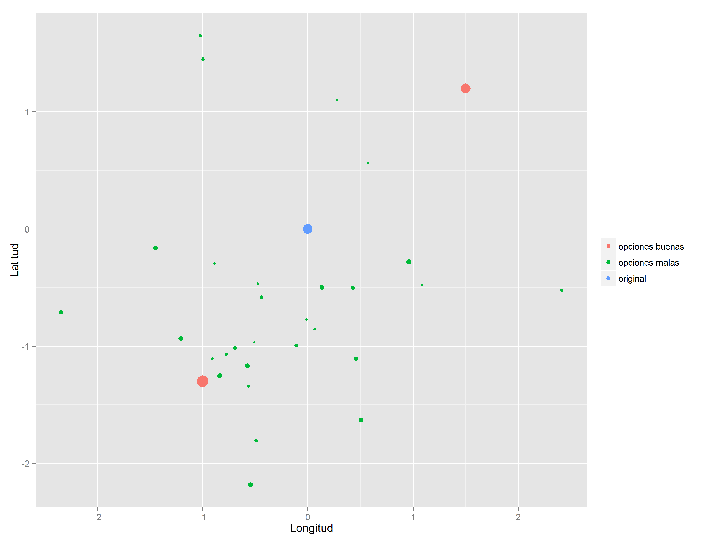

Modelo de recomendación de hoteles
========================================================
author: Revenue Management. Preparado por Felipe Gerard
date: 25 de junio de 2015

Antecedentes
========================================================

- **Objetivo:** Recomendar hoteles similares a uno dado
- Solución actual: búsqueda por destino y estrellas
- **Problemas:**
  - No se toma en cuenta la filosofía del hotel
  - No se aprovecha toda la información disponible
  - El criterio es más o menos estático
- **Ideas:**
  - Tomar en cuenta el perfil de los hoteles
  - Incorporar información geográfica
  - Hacer que el criterio sea dinámico

Plan de ataque
========================================================

1. Obtener información relevante
  - Servicios
  - Geolocalización
  - Precios recientes
2. Caracterizar los hoteles
  - Categorías de servicios equivalentes
3. Generar un criterio integral de similitud
  - Cercanía
  - Precio
  - Al menos los mismos servicios
  - Perfil similar

Información
========================================================

- Nos la saltaremos...

Caracterización de hoteles
========================================================

- Usar servicios es miope
- No toma en cuenta los sustitutos
- Agrupar servicios manualmente con modelo de apoyo:

Precio y cercanía
========================================================

- **Precio:**
  - Favorecer precios bajos
  - Porcentaje máximo arriba del hotel original
- **Cercanía:**
  - Criterio dinámico
  - Depende de densidad de hoteles
  - Evita enmascaramiento por hoteles distintos
  - Gráfica

Cercanía
========================================================

Similaridad
========================================================

 

Similaridad
========================================================

 

Comentarios finales
========================================================

- La base de servicios _no está homologada_ para los demás países
- El modelo actual sólo está hecho con los datos de México
- Falta por definir algunos detalles del modelo
- Demo

